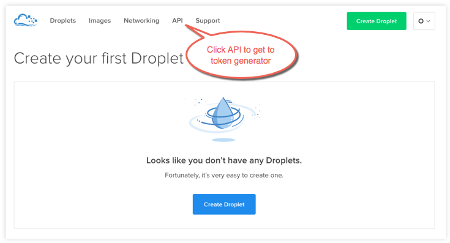
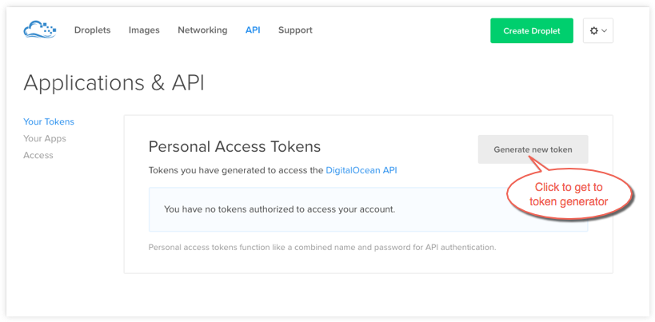
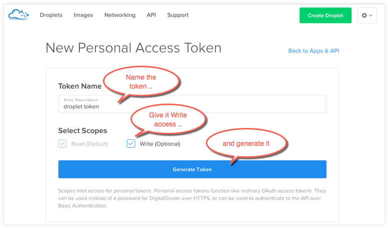
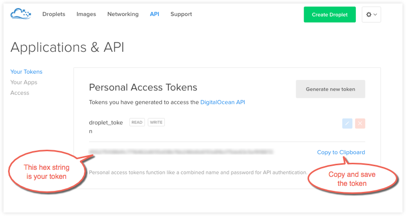

<!--[metadata]>
+++
title = "Example: Use Docker Machine to provision cloud hosts"
description = "Example of using Docker Machine to install Docker Engine on a cloud provider, using Digital Ocean."
keywords = ["cloud, docker, machine, documentation,  installation, digitalocean"]
aliases = ["/install/cloud/cloud-ex-machine-ocean.md"]
[menu.main]
parent = "install_cloud"
+++
<![end-metadata]-->

# Example: Use Docker Machine to provision cloud hosts

Docker Machine driver plugins are available for many cloud platforms, so you can use Machine to provision cloud hosts. When you use Docker Machine for provisioning, you create cloud hosts with Docker Engine installed on them.

You'll need to install and run Docker Machine, and create an account with the cloud provider.

Then you provide account verification, security credentials, and configuration options for the providers as flags to `docker-machine create`. The flags are unique for each cloud-specific driver.  For instance, to pass a Digital Ocean access token you use the `--digitalocean-access-token` flag.

As an example, let's take a look at how to create a Dockerized <a href="https://digitalocean.com" target="_blank">Digital Ocean</a> _Droplet_ (cloud server).

### Step 1. Create a Digital Ocean account and log in

If you have not done so already, go to <a href="https://digitalocean.com" target="_blank">Digital Ocean</a>, create an account, and log in.

### Step 2. Generate a personal access token

To generate your access token:

  1. Go to the Digital Ocean administrator console and click **API** in the header.

    

  2. Click **Generate New Token** to get to the token generator.

    

  3. Give the token a clever name (e.g. "machine"), make sure the **Write (Optional)** checkbox is checked, and click **Generate Token**.

    

  4. Grab (copy to clipboard) the generated big long hex string and store it somewhere safe.

    

    This is the personal access token you'll use in the next step to create your cloud server.

### Step 3. Start Docker Machine

1. If you have not done so already, install Docker Machine on your local host.

  * <a href="https://docs.docker.com/engine/install/mac/" target="_blank"> How to install Docker Machine on Mac OS X</a>

  * <a href="https://docs.docker.com/engine/install/windows/" target="_blank">How to install Docker Machine on Windows</a>

  * <a href="https://docs.docker.com/machine/install-machine/" target="_blank">Install Docker Machine directly</a> (e.g., on Linux)

2. At a command terminal, use `docker-machine ls` to get a list of Docker Machines and their status.

        $ docker-machine ls
        NAME      ACTIVE   DRIVER       STATE     URL   SWARM
        default   -        virtualbox   Stopped    

3. If Machine is stopped, start it.

        $ docker-machine start default
        (default) OUT | Starting VM...
        Started machines may have new IP addresses. You may need to re-run the `docker-machine env` command.

4. Set environment variables to connect your shell to the local VM.

        $ docker-machine env default
        export DOCKER_TLS_VERIFY="1"
        export DOCKER_HOST="tcp://xxx.xxx.xx.xxx:xxxx"
        export  DOCKER_CERT_PATH="/Users/londoncalling/.docker/machine/machines/default"
        export DOCKER_MACHINE_NAME="default"
        # Run this command to configure your shell:
        # eval "$(docker-machine env default)"

        eval "$(docker-machine env default)"

5. Re-run `docker-machine ls` to check that it's now running.

        $ docker-machine ls
        NAME      ACTIVE   DRIVER       STATE     URL                         SWARM
        default   *        virtualbox   Running   tcp:////xxx.xxx.xx.xxx:xxxx  

6. Run some Docker commands to make sure that Docker Engine is also up-and-running.

    We'll run `docker run hello-world` again, but you could try `docker ps`,  `docker run docker/whalesay cowsay boo`, or another command to verify that Docker is running.

        $ docker run hello-world

        Hello from Docker.
        This message shows that your installation appears to be working correctly.

        To generate this message, Docker took the following steps:
        1. The Docker client contacted the Docker daemon.
        2. The Docker daemon pulled the "hello-world" image from the Docker Hub.
        3. The Docker daemon created a new container from that image which runs the executable that produces the output you are currently reading.
        4. The Docker daemon streamed that output to the Docker client, which sent it to your terminal.

        To try something more ambitious, you can run an Ubuntu container with:
        $ docker run -it ubuntu bash

        Share images, automate workflows, and more with a free Docker Hub account: https://hub.docker.com

        For more examples and ideas, visit:
        https://docs.docker.com/userguide/

### Step 4. Use Docker Machine to Create the Droplet

1. Run `docker-machine create` with the `digitalocean` driver and pass your key to the `--digitalocean-access-token` flag, along with a name for the new cloud server.

    For this example, we'll call our new Droplet "docker-sandbox".

        $ docker-machine create --driver digitalocean --digitalocean-access-token 455275108641c7716462d6f35d08b76b246b6b6151a816cf75de63c5ef918872 docker-sandbox
        Running pre-create checks...
        Creating machine...
        (docker-sandbox) OUT | Creating SSH key...
        (docker-sandbox) OUT | Creating Digital Ocean droplet...
        (docker-sandbox) OUT | Waiting for IP address to be assigned to the Droplet...
        Waiting for machine to be running, this may take a few minutes...
        Machine is running, waiting for SSH to be available...
        Detecting operating system of created instance...
        Detecting the provisioner...
        Provisioning created instance...
        Copying certs to the local machine directory...
        Copying certs to the remote machine...
        Setting Docker configuration on the remote daemon...
        To see how to connect Docker to this machine, run: docker-machine env docker-sandbox

      When the Droplet is created, Docker generates a unique SSH key and stores it on your local system in `~/.docker/machines`. Initially, this is used to provision the host. Later, it's used under the hood to access the Droplet directly with the `docker-machine ssh` command. Docker Engine is installed on the cloud server and the daemon is configured to accept remote connections over TCP using TLS for authentication.

2. Go to the Digital Ocean console to view the new Droplet.

    

3. At the command terminal, run `docker-machine ls`.

        $ docker-machine ls
        NAME             ACTIVE   DRIVER         STATE     URL                         SWARM
        default          *        virtualbox     Running   tcp://192.168.99.100:2376   
        docker-sandbox   -        digitalocean   Running   tcp://45.55.139.48:2376     

    Notice that the new cloud server is running but is not the active host. Our command shell is still connected to the default machine, which is currently the active host as indicated by the asterisk (*).

4. Run `docker-machine env docker-sandbox` to get the environment commands for the new remote host, then run `eval` as directed to re-configure the shell to connect to `docker-sandbox`.

        $ docker-machine env docker-sandbox
        export DOCKER_TLS_VERIFY="1"
        export DOCKER_HOST="tcp://45.55.222.72:2376"
        export DOCKER_CERT_PATH="/Users/victoriabialas/.docker/machine/machines/docker-sandbox"
        export DOCKER_MACHINE_NAME="docker-sandbox"
        # Run this command to configure your shell:
        # eval "$(docker-machine env docker-sandbox)"

        $ eval "$(docker-machine env docker-sandbox)"

5. Re-run `docker-machine ls` to verify that our new server is the active machine, as indicated by the asterisk (*) in the ACTIVE column.

        $ docker-machine ls
        NAME             ACTIVE   DRIVER         STATE     URL                         SWARM
        default          -        virtualbox     Running   tcp://192.168.99.100:2376   
        docker-sandbox   *        digitalocean   Running   tcp://45.55.222.72:2376     

6. Log in to the Droplet with the `docker-machine ssh` command.

        $ docker-machine ssh docker-sandbox
        Welcome to Ubuntu 14.04.3 LTS (GNU/Linux 3.13.0-71-generic x86_64)

        * Documentation:  https://help.ubuntu.com/

        System information as of Mon Dec 21 21:38:53 EST 2015

        System load:  0.77               Processes:              70
        Usage of /:   11.4% of 19.56GB   Users logged in:        0
        Memory usage: 15%                IP address for eth0:    45.55.139.48
        Swap usage:   0%                 IP address for docker0: 172.17.0.1

        Graph this data and manage this system at:
        https://landscape.canonical.com/

7. Verify Docker Engine is installed correctly by running `docker run hello-world`.

          ubuntu@ip-172-31-0-151:~$ sudo docker run hello-world
          Unable to find image 'hello-world:latest' locally
          latest: Pulling from library/hello-world
          b901d36b6f2f: Pull complete
          0a6ba66e537a: Pull complete
          Digest: sha256:8be990ef2aeb16dbcb9271ddfe2610fa6658d13f6dfb8bc72074cc1ca36966a7
          Status: Downloaded newer image for hello-world:latest

          Hello from Docker.
          This message shows that your installation appears to be working correctly.
          . . .

      You can type keyboard command Control-D or `exit` to log out of the remote server.

#### Understand the defaults and options on the create command

For convenience, `docker-machine` will use sensible defaults for choosing settings such as the image that the server is based on, but you override the defaults using the respective flags (e.g. `--digitalocean-image`). This is useful if, for example, you want to create a cloud server with a lot of memory and CPUs (by default `docker-machine` creates a small server). For a full list of the flags/settings available and their defaults, see the output of `docker-machine create -h` at the command line. See also <a href="https://docs.docker.com/machine/drivers/os-base/" target="_blank">Driver options and operating system defaults</a> and information about the <a href="https://docs.docker.com/machine/reference/create/" target="_blank">create</a> command in the Docker Machine documentation.

### Step 5. Use Docker Machine to remove the Droplet

To remove a host and all of its containers and images, first stop the machine, then use `docker-machine rm`:

    $ docker-machine stop docker-sandbox
    $ docker-machine rm docker-sandbox
    Do you really want to remove "docker-sandbox"? (y/n): y
    Successfully removed docker-sandbox

    $ docker-machine ls
    NAME      ACTIVE   DRIVER       STATE     URL                         SWARM
    default   *        virtualbox   Running   tcp:////xxx.xxx.xx.xxx:xxxx

If you monitor the Digital Ocean console while you run these commands, you will see it update first to reflect that the Droplet was stopped, and then removed.

If you create a host with Docker Machine, but remove it through the cloud provider console, Machine will lose track of the server status. So please use the `docker-machine rm` command for hosts you create with `docker-machine --create`.

## Where to go next

* To learn more about options for installing Docker Engine on cloud providers, see [Understand cloud install options and choose one](cloud.md).

* To learn more about using Docker Machine to provision cloud hosts, see <a href="https://docs.docker.com/machine/get-started-cloud/" target="_blank">Using Docker Machine with a cloud provider</a>.

* To get started with Docker, see <a href="https://docs.docker.com/engine/userguide/" target="_blank"> Docker User Guide</a>.
